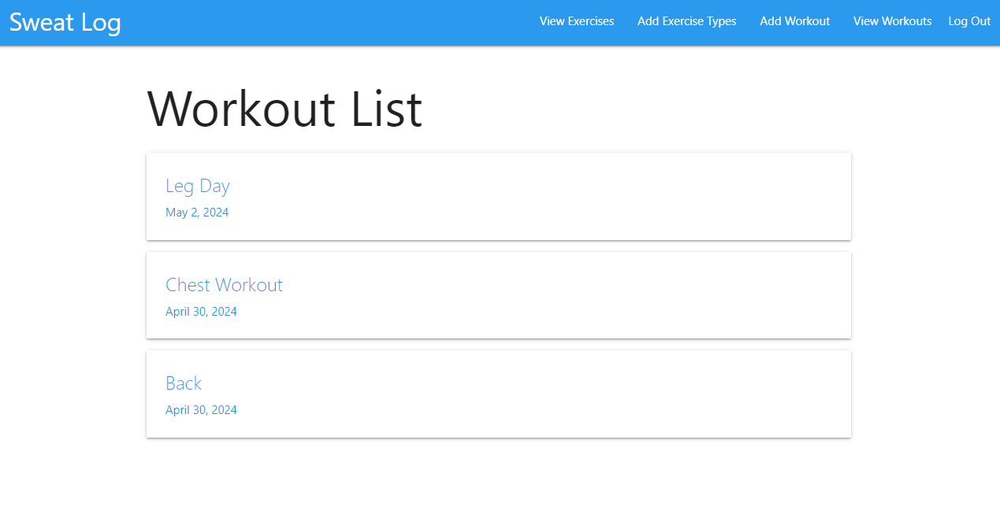
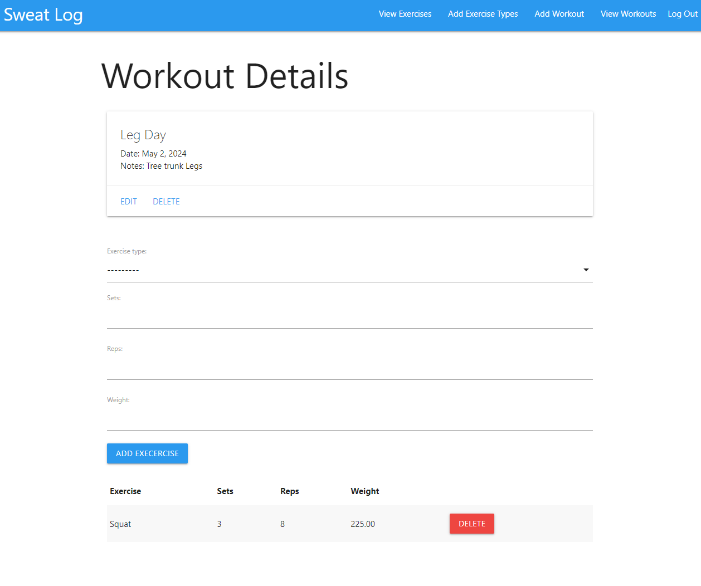

# Bookview
Sweat Log is your ultimate companion on your fitness journey, designed to help you track your workouts, stay motivated, and achieve your fitness goals. Whether you're a seasoned athlete or just starting out, Sweat Log provides you with the tools you need to take your workouts to the next level.

Features:

- Track Workouts: Log your workouts with ease, including details like exercise type, sets, reps, and weight lifted.
- Personalized Experience: Customize your workout routines and exercises to suit your unique fitness needs and      preferences.
- Visual Progress: Visualize your progress over time with interactive charts and graphs, helping you stay motivated and focused on your goals.
- Muscle Group Highlighting: Easily identify which muscle groups you've targeted in each workout, ensuring balanced and effective training.
- User-Friendly Interface: Enjoy a seamless and intuitive user experience, making it effortless to navigate and use the app.
- Secure and Private: Rest assured that your workout data is kept safe and private, accessible only to you.

# Screenshot

# Technologies Used

- Django
- PostgresSQL
- HTML
- CSS

# Getting Started

[Click to View Project Planning](https://trello.com/b/jm4A5V6g/bookie)
[Click to use Bookview](https://sweatlog-f4ca50361025.herokuapp.com/)

# Next Steps

- Image will show based on muscle group